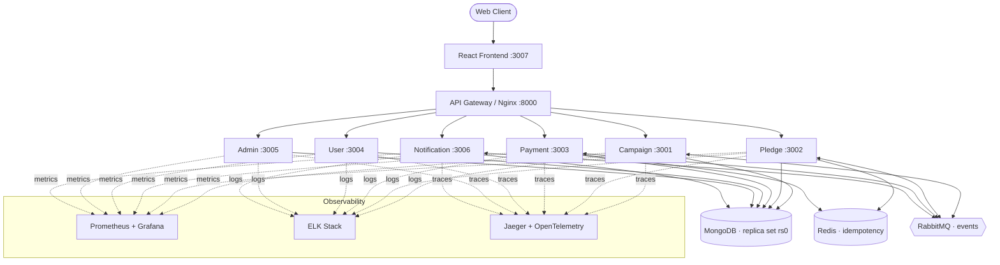

<div align="center">

# 💙 CareForAll — Event-Driven Donation Platform

**A production-grade fundraising backend built as Node.js microservices, with a React frontend and a full observability stack.**

It demonstrates the reliability patterns real payment systems depend on:
**Idempotency · Transactional Outbox · Payment State Machine · CQRS Read Models.**


</div>

---

## ✨ Why this project stands out

This isn't a CRUD demo — it's a **distributed system** engineered around the failure modes that break naïve payment backends: duplicate charges, lost events, invalid state transitions, and slow aggregate reads. Every core problem is solved with an industry-standard pattern, wired together and observable end-to-end.

| Real-world problem | Engineered solution | Where |
|---|---|---|
| Retried/duplicate requests cause **double charges** | **Idempotency** — Redis-backed key check with persistence fallback | Pledge, Payment |
| Events **lost** in the crash window between DB write and publish | **Transactional Outbox** — event + business write in one Mongo transaction, published by a worker | Pledge |
| Payments reach **illegal states** (e.g. refund before capture) | **State Machine** — only valid transitions allowed, deterministic errors | Payment |
| Aggregate reads (campaign totals) get **slow under load** | **CQRS** — materialized read model updated from events | Campaign |
| "It's slow / it's broken" with **no visibility** | **3 pillars of observability** — metrics, logs, traces across every service | All |

---

## 🚀 Quick Start

**Prerequisite:** Docker Desktop only — MongoDB runs locally as a container (no cloud account needed).

```bash
docker compose up -d      # build & start the entire stack
docker compose ps         # every service should be Up / healthy
```

| Surface | URL |
|---|---|
| 🖥️ Frontend (React SPA) | http://localhost:3007 |
| 🚪 API Gateway (Nginx) | http://localhost:8000 |
| 🔬 Microservices | `3001`–`3006` — each exposes `/health` and `/metrics` |

**Verify every reliability pattern in one command:**

```powershell
.\scripts\feature-test.ps1
```

For a demo-ready, step-by-step walkthrough see **[SUPERVISOR_CHECKLIST.md](./SUPERVISOR_CHECKLIST.md)**.

---

## 🏗️ Architecture



**Event flow:** a `pledge.created` event fans out over RabbitMQ → **Campaign** updates its CQRS totals and **Notification** creates a user notification. Services never call each other synchronously for these side effects — they stay **loosely coupled** through the broker.

---

## 🧩 Services

Six independently deployable Node.js microservices, each with its own database, `Dockerfile`, health check, and README.

| Service | Port | Responsibility | Signature Pattern |
|---------|------|----------------|-------------------|
| [Campaign](./services/campaign-service/) | 3001 | Campaign CRUD & totals | **CQRS** read model |
| [Pledge](./services/pledge-service/) | 3002 | Donation pledges | **Idempotency** + **Transactional Outbox** |
| [Payment](./services/payment-service/) | 3003 | Payment processing | **State Machine** + webhooks |
| [User](./services/user-service/) | 3004 | Auth & profiles | **JWT** |
| [Admin](./services/admin-service/) | 3005 | Admin statistics | Aggregation |
| [Notification](./services/notification-service/) | 3006 | User notifications | **Event-driven** consumer |

---

## 🛠️ Tech Stack

| Layer | Technologies |
|---|---|
| **Backend** | Node.js 18, Express, Mongoose |
| **Frontend** | React 18, Vite, React Router, Axios |
| **Data** | MongoDB (single-node replica set `rs0` for multi-doc transactions) |
| **Messaging** | RabbitMQ (`amqplib`) — event-driven choreography |
| **Caching / Idempotency** | Redis |
| **Gateway** | Nginx (reverse proxy, single entry point) |
| **Metrics** | Prometheus + Grafana (`prom-client`, cAdvisor, node-exporter) |
| **Logging** | ELK — Winston → Logstash → Elasticsearch → Kibana |
| **Tracing** | OpenTelemetry auto-instrumentation → Jaeger |
| **CI/CD** | GitHub Actions (path-filtered matrix builds) |
| **Runtime** | Docker & Docker Compose |

---

## 🔎 Observability (3 Pillars)

Every service is instrumented across all three pillars, so you can debug the way you would in production: **metric → trace → log**.

| Pillar | Stack | UI |
|---|---|---|
| **Metrics** | Prometheus scrapes each `/metrics` endpoint; Grafana dashboards (provisioned as code) | Prometheus `9090` · Grafana `3000` |
| **Logs** | Structured JSON via Winston, shipped to Logstash → Elasticsearch | Kibana `5601` |
| **Traces** | OpenTelemetry auto-instrumentation exports spans to Jaeger | Jaeger `16686` |

> **Debugging story:** latency spikes → confirm in **Grafana** → open the slow request in **Jaeger** to find the offending span → drill into **Kibana** for the exact error. Message broker health is visible at RabbitMQ UI `15672`.

---

## 🔁 CI/CD Pipeline

A [GitHub Actions workflow](./.github/workflows/ci.yml) that behaves like a real monorepo pipeline — it only does work for what actually changed:

1. **Detect changes** — `paths-filter` figures out which service(s) were modified.
2. **Test (matrix)** — runs Jest **only** for the changed services, fanned out in parallel.
3. **Build (matrix)** — builds & tags Docker images with **semver + commit SHA**, only on `main`, only after tests pass.
4. **Compose validate** — `docker compose config` guarantees the full stack still composes.

The result: fast, cost-efficient CI where nothing merges to `main` unless its checks are green.

---

## ✅ Testing

```bash
# Unit tests (per service, Jest)
cd services/payment-service && npm install && npm test

# End-to-end feature test — exercises every reliability pattern
.\scripts\feature-test.ps1

# Load / stress test
.\scripts\stress-test.ps1 -Requests 300
```

---

## 📁 Project Structure

```
CareForAll/
├── services/               # 6 Node.js microservices (each self-contained, with README)
│   ├── campaign-service/    #  CQRS read model
│   ├── pledge-service/      #  Idempotency + Transactional Outbox
│   ├── payment-service/     #  State machine + webhooks
│   ├── user-service/        #  JWT auth
│   ├── admin-service/       #  Aggregated stats
│   └── notification-service/#  Event-driven consumer
├── frontend/               # React + Vite SPA
├── infrastructure/         # Nginx gateway, Prometheus, Grafana, Logstash configs
├── examples/               # Example API requests & responses
├── scripts/                # feature-test.ps1, stress-test.ps1
├── .github/workflows/      # CI pipeline
├── docker-compose.yml      # Full stack incl. local MongoDB replica set
├── SUPERVISOR_CHECKLIST.md # Manual verification walkthrough
└── CareForAll_API.postman_collection.json
```

---

## 🎯 Engineering Highlights

- **Distributed-systems patterns** implemented from first principles — not pulled from a framework.
- **Event-driven, loosely coupled** services communicating over RabbitMQ.
- **Transactional integrity** using MongoDB multi-document transactions (replica set).
- **Full observability** wired end-to-end across metrics, logs, and traces.
- **Production-shaped CI/CD** with change detection, matrix parallelism, and image tagging.
- **One-command local footprint** — the entire platform, database, and observability stack boot from a single `docker compose up`.

---

## 🛑 Stop

```bash
docker compose down       # stop, keep data (mongo-data volume)
docker compose down -v    # stop and wipe all data
```

---

<div align="center">

**Built by [Md. Nasir Uddin](https://github.com/nasir82)** · CUET
Licensed under the [MIT License](./LICENSE)

</div>
