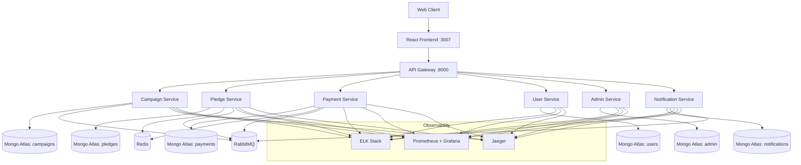
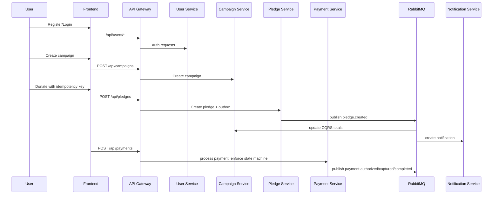

# CareForAll - Overall Project Presentation

## Slide 1 - Executive Summary

CareForAll is a microservices-based donation platform engineered for reliability and scale.

Key goals delivered:

- Prevent duplicate financial operations with idempotency
- Guarantee event durability with transactional outbox
- Enforce payment correctness with state machine transitions
- Improve read performance with CQRS materialized totals
- Ensure operational visibility using logs, metrics, and traces

## Slide 2 - Problem and Solution Fit

Problems addressed:

- Duplicate requests and retries
- Event loss during service failure windows
- Invalid payment lifecycle transitions
- Slow aggregate reads under load

Solution fit:

- Redis-backed idempotency controls duplicate side effects
- Outbox pattern guarantees eventual event publication
- Transition validator blocks illegal payment states
- CampaignTotals read model provides fast aggregate queries

## Slide 3 - High-Level Architecture

## Slide 4 - End-to-End Working Pipeline

## Slide 5 - Reliability Mechanisms

- Idempotency:
  - Request key checked in Redis + persistence fallback
  - Duplicate requests return same business result
- Transactional Outbox:
  - Business write and outbox event in one DB transaction
  - Worker publishes pending events to broker
- Payment State Machine:
  - Allowed transitions only
  - Invalid transitions return deterministic error
- CQRS Read Model:
  - Fast campaign aggregate reads with precomputed totals

## Slide 6 - Observability and Ops

- Centralized logging via ELK for troubleshooting and audit
- Metrics via Prometheus and Grafana for SLI/SLO tracking
- Distributed tracing via Jaeger for latency root-cause analysis
- Health checks and restart policies in compose improve resilience

## Slide 7 - Judge Demo Pipeline

1. Start stack: `docker compose up -d`
2. Verify health and reachability
3. Run `test-all-apis.ps1`
4. Confirm idempotency, outbox behavior, payment transitions, CQRS totals
5. Validate dashboards/logs/traces

## Slide 8 - Current Maturity and Next Steps

Current strengths:

- Clear architecture and stack separation
- Practical implementation of core distributed-system patterns
- Full local demo footprint for judging

Recommended next steps:

- Add CI pipeline with automated API/integration tests
- Move credentials and secrets to secure vault/secret manager
- Add production hardening (authz, limits, backup/recovery, HA broker)
