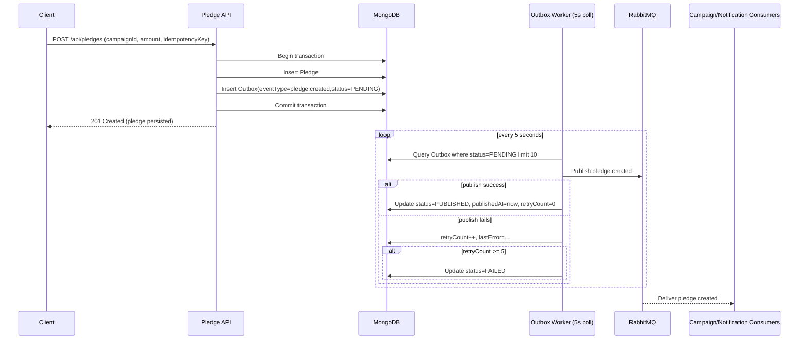
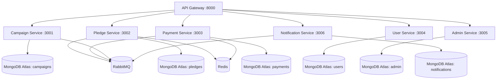
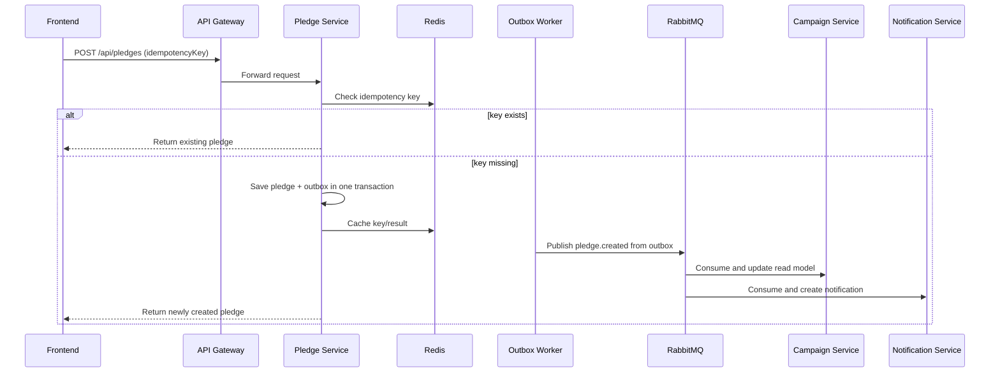

# Backend Stack README

## 1) Scope

This stack contains the Node.js microservices implementing business workflows and reliability patterns.

Services:

- Campaign Service (`3001`) - campaign CRUD + CQRS read model
- Pledge Service (`3002`) - pledge creation + idempotency + transactional outbox
- Payment Service (`3003`) - payment processing + state machine + webhook handling
- User Service (`3004`) - registration, login, profile
- Admin Service (`3005`) - admin stats endpoint
- Notification Service (`3006`) - user notifications query

## 2) Core Patterns Implemented

- Idempotency: Redis + persistent fallback
- Transactional Outbox: same DB transaction for business data + outbox event
- State Machine: valid payment status transitions only
- CQRS Read Model: campaign totals materialized for fast reads
- Event-driven communication: RabbitMQ pub/sub between services

## 3) How Transactional Outbox Works Here (Actual Implementation)

The transactional outbox pattern is implemented in the Pledge Service so that data write and event intent are committed atomically.

What happens on `POST /api/pledges`:

1. Service starts a MongoDB session and transaction.
2. It validates and checks idempotency (`Redis`, then `MongoDB` fallback).
3. It creates a `Pledge` document.
4. In the same transaction, it creates an `Outbox` document with `status = PENDING` and `eventType = pledge.created`.
5. It commits the transaction.
6. A background outbox worker polls every 5 seconds, publishes pending events to RabbitMQ, then marks them `PUBLISHED`.
7. If publish fails, it increments `retryCount`; after 5 retries, event is marked `FAILED`.

Reference implementation files:

- `services/pledge-service/src/routes/pledges.js` (transaction + outbox write)
- `services/pledge-service/src/models/Outbox.js` (outbox schema and indexes)
- `services/pledge-service/src/services/outboxWorker.js` (poll/retry/publish logic)
- `services/pledge-service/src/app.js` (worker startup)

## 4) Transactional Outbox Working Diagram



## 5) Backend Service Topology Diagram



## 6) Working Pipeline (Donation Flow)



## 7) API Surface (High-level)

- `/api/campaigns` (create/list/get)
- `/api/pledges` (create/get/get by user)
- `/api/payments` (create/get)
- `/api/webhooks/:provider` (payment webhooks)
- `/api/users/register`, `/api/users/login`, `/api/users/:id`
- `/api/admin/stats`
- `/api/notifications/user/:userId`

## 8) Outbox Demonstration Pipeline (Judge-ready)

Use this to demonstrate correctness in a live evaluation.

### Step A: Start dependencies and services

```bash
docker compose up -d pledge-service campaign-service notification-service rabbitmq redis
```

### Step B: Create a pledge (creates pledge + outbox row atomically)

```bash
curl -X POST http://localhost:3002/api/pledges \
  -H "Content-Type: application/json" \
  -d '{
    "campaignId": "cmp-001",
    "amount": 100,
    "idempotencyKey": "judge-demo-001",
    "userId": "user-001"
  }'
```

### Step C: Verify worker publish path

```bash
docker compose logs pledge-service --tail 100
```

Look for logs indicating:

- Pledge created with outbox event
- Outbox event published

### Step D: Verify idempotency behavior

Repeat Step B with the same `idempotencyKey`.
Expected: existing pledge returned (no duplicate business record).

### Step E: Demonstrate failure/recovery behavior

```bash
docker compose stop rabbitmq
# send a new pledge request (new idempotencyKey), then watch retries
docker compose logs pledge-service --tail 200
docker compose start rabbitmq
# worker should recover and publish pending events on next poll cycles
docker compose logs pledge-service --tail 200
```

Expected:

- While RabbitMQ is down: publish failures, `retryCount` increases.
- After RabbitMQ is up: pending event is published and marked `PUBLISHED` (unless already moved to `FAILED`).

## 9) Runbook

### Start all backend services with dependencies

```bash
docker compose up -d \
  campaign-service pledge-service payment-service \
  user-service admin-service notification-service \
  rabbitmq redis jaeger logstash
```

### Health checks

```bash
curl http://localhost:3001/health
curl http://localhost:3002/health
curl http://localhost:3003/health
curl http://localhost:3004/health
curl http://localhost:3005/health
curl http://localhost:3006/health
```

## 10) Judge Checklist

- Duplicate pledge with same idempotency key returns same business result.
- Outbox event is eventually visible/consumed even if request path is interrupted.
- Invalid payment state transition is rejected.
- Campaign totals reflect event-driven updates.

## 11) Risks and Notes

- Current route-level auth/authorization appears minimal and should be hardened for production.
- MongoDB Atlas credentials are embedded in compose; move to secrets/environment management for production use.
