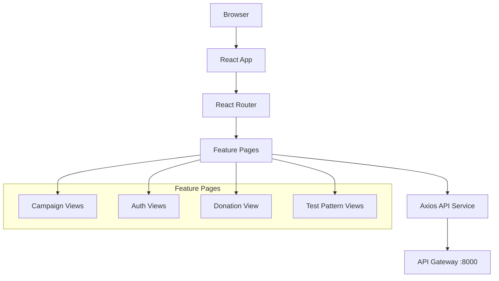
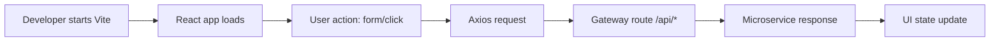

# Frontend Stack README

## 1) Scope

This stack contains the React single-page application used for donor, campaign, profile, admin, notifications, and pattern-demo flows.

- Technology: React 18 + React Router + Axios + Vite
- Source: `frontend/src`
- Runtime port (local): `5173` (Vite dev), `3007` (Docker Nginx container)
- Upstream API base URL: `http://localhost:8000/api`

## 2) Stack Components

- Routing shell: `frontend/src/App.jsx`
- UI pages:
  - Home, Campaigns, Campaign Detail, Donate
  - Login/Register/Profile
  - Admin Dashboard
  - Notifications
  - Pattern demos: Idempotency, Outbox, State Machine, CQRS
- API client layer: `frontend/src/services/api.js`

## 3) Frontend Architecture Diagram



## 4) Working Pipeline (Frontend)



## 5) Runbook

### Local Dev

```bash
cd frontend
npm install
npm run dev
```

### Production-like (Docker)

```bash
docker compose up -d frontend api-gateway
```

Open:

- Frontend: `http://localhost:3007`
- Gateway: `http://localhost:8000`

## 6) Judge Checklist

- App home page loads at `http://localhost:3007`
- Campaign list page is reachable
- Auth routes are reachable
- Testing routes (`/test/idempotency`, `/test/outbox`, `/test/state-machine`, `/test/cqrs`) render correctly
- Requests pass through API gateway and return data

## 7) Risks and Notes

- No frontend unit/e2e test framework is configured yet.
- Production API base URL should be parameterized through environment variables if deployed outside this compose network.
