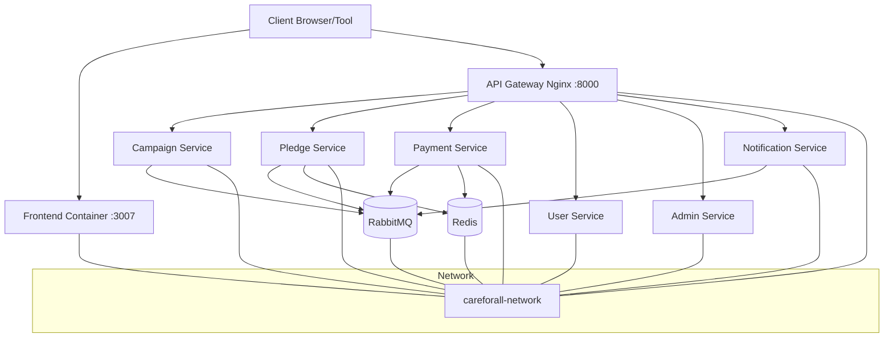
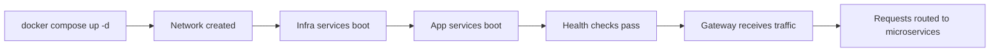

# Infrastructure Stack README

## 1) Scope

This stack defines container runtime, service networking, ingress, and platform dependencies.

Primary file:

- `docker-compose.yml`

Core infrastructure components:

- API Gateway (Nginx)
- RabbitMQ (message broker)
- Redis (idempotency + cache)
- Container network and health checks

## 2) Infrastructure Diagram



## 3) Nginx Gateway Routing

- `/api/campaigns` -> campaign-service
- `/api/pledges` -> pledge-service
- `/api/payments` -> payment-service
- `/api/webhooks` -> payment-service
- `/api/users` -> user-service
- `/api/admin` -> admin-service
- `/api/notifications` -> notification-service
- Rate limit configured at `1000 req/s` zone

## 4) Working Pipeline (Infra Lifecycle)



## 5) Runbook

### Start full platform

```bash
docker compose up -d
```

### Check health

```bash
docker compose ps
```

### View logs

```bash
docker compose logs -f api-gateway
```

## 6) Judge Checklist

- All containers are `Up` and healthy.
- Gateway health endpoint returns success at `http://localhost:8000/health`.
- RabbitMQ UI loads at `http://localhost:15672`.
- Redis is reachable for idempotency paths.

## 7) Risks and Notes

- Externalized secret management is recommended for production.
- Capacity/load tuning (CPU/memory limits, autoscaling, HA broker setup) should be defined for production SLA.
