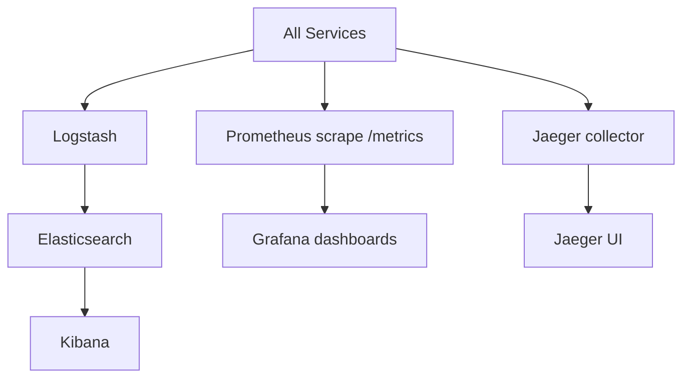
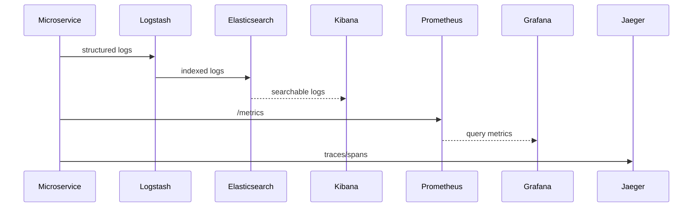

# Observability Stack README

## 1) Scope

This stack provides logs, metrics, and tracing for end-to-end visibility.

Components:

- ELK: Elasticsearch + Logstash + Kibana
- Metrics: Prometheus + Grafana
- Tracing: Jaeger
- Service-side metrics endpoint: `/metrics`

## 2) Observability Architecture Diagram



## 3) Working Pipeline



## 4) Access Endpoints

- Kibana: `http://localhost:5601`
- Elasticsearch: `http://localhost:9200`
- Prometheus: `http://localhost:9090`
- Grafana: `http://localhost:3000` (admin/admin123 from compose)
- Jaeger: `http://localhost:16686`

## 5) Runbook

```bash
docker compose up -d elasticsearch logstash kibana prometheus grafana jaeger
```

Check sample metric:

```bash
curl http://localhost:3001/metrics
```

## 6) Judge Checklist

- Logs are searchable in Kibana.
- Service metrics appear in Prometheus targets.
- Grafana can query Prometheus datasource.
- Traces are visible in Jaeger after API calls.

## 7) Risks and Notes

- Retention, index lifecycle policies, and dashboard versioning should be formalized for production operations.
