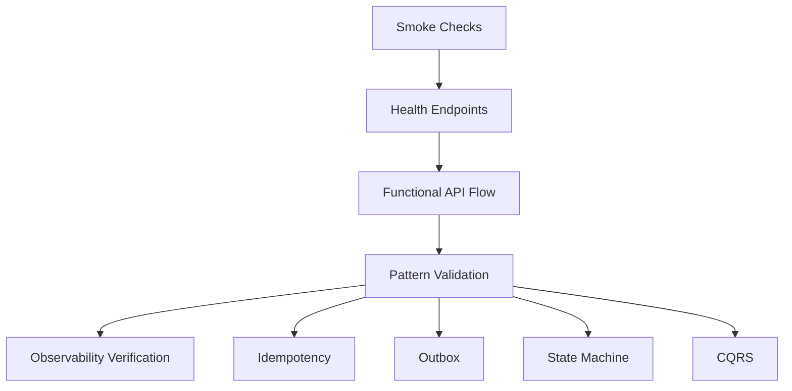
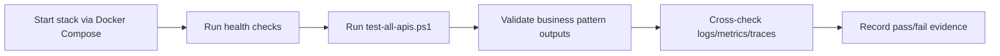

# Testing and Validation Stack README

## 1) Scope

This stack covers manual and scripted validation for API health, key patterns, and end-to-end flow.

Existing scripts:

- `test-all-apis.ps1` (comprehensive API flow tests)
- `test-api.ps1` (single API checks)
- `test-services.sh` (legacy/simple service checks)
- Postman collection: `CareForAll_API.postman_collection.json`

## 2) Test Strategy Diagram



## 3) Working Pipeline (Judge Execution)



## 4) Runbook

### PowerShell (Windows)

```powershell
./test-all-apis.ps1
```

### Bash

```bash
bash test-services.sh
```

## 5) Core Assertions

- Health endpoints return `200`.
- Duplicate key usage returns deterministic idempotent result.
- Payment state transitions are valid and reject invalid transitions.
- Campaign totals update after related events.
- Notifications are generated and retrievable.

## 6) Judge Checklist

- Run script output includes all service checks.
- At least one full e2e flow succeeds from user registration to notification fetch.
- Observability tools confirm system activity generated by tests.

## 7) Risks and Notes

- There is no CI runner configured yet; tests are currently script-driven/manual.
- Add contract and load tests for stronger release confidence.
